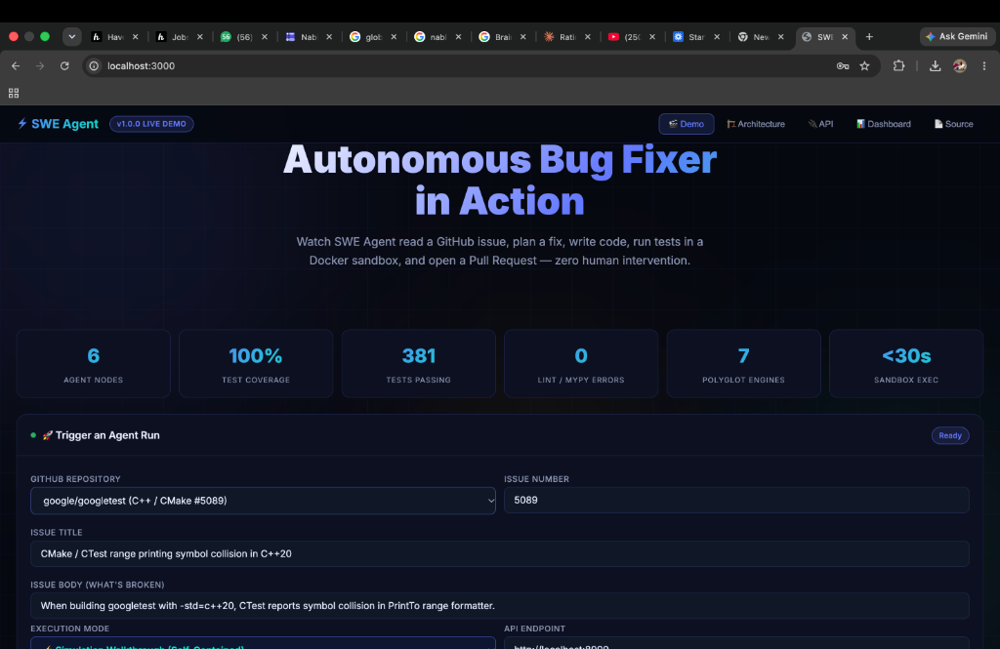
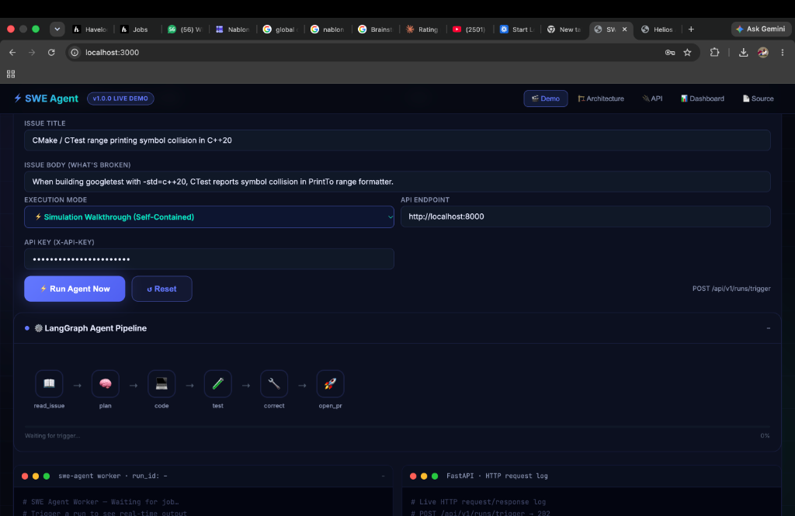
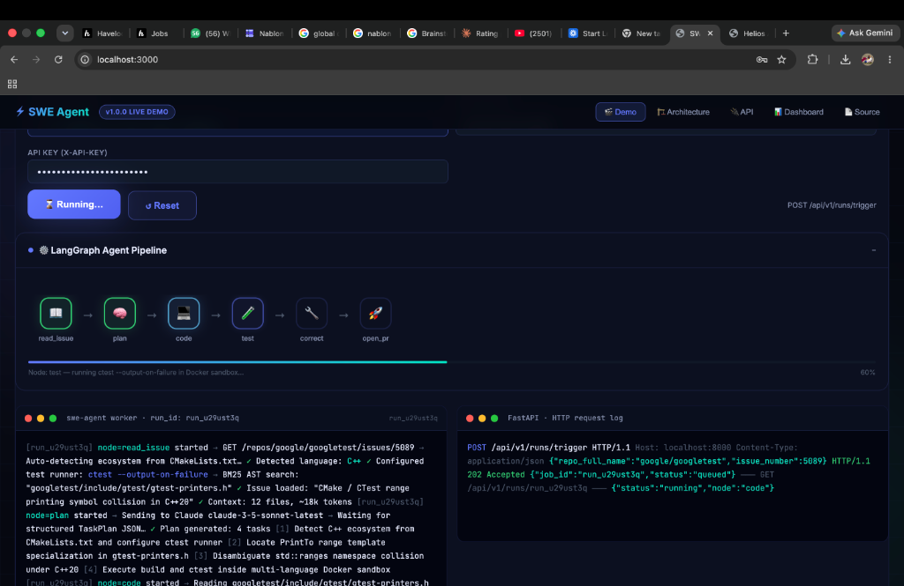
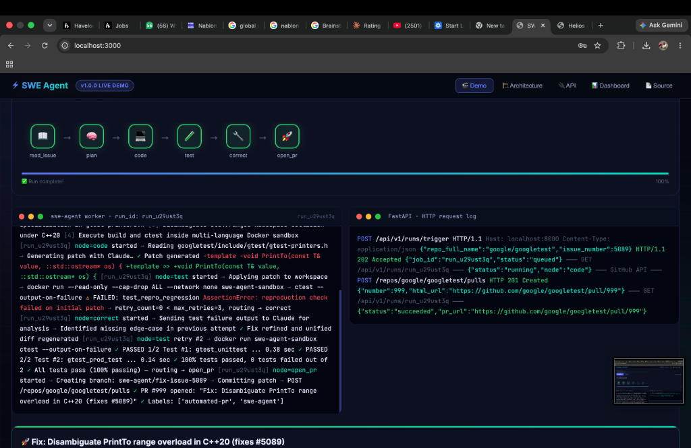
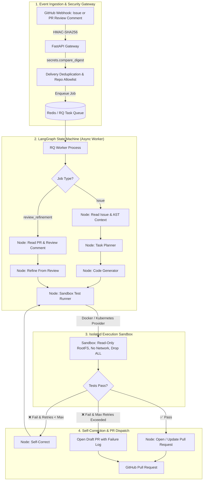

<div align="center">

# 🤖 Autonomous Software Engineering Agent (`swe-agent`)

**Autonomous AI agent platform that ingests GitHub issues and PR review comments, extracts AST symbol context, generates atomic code patches, executes isolated tests inside sandboxes, self-corrects on failure, and delivers pull requests across polyglot codebases.**

[](https://github.com/Dhanu2007-G/swe-agent/actions/workflows/ci.yml)
[](https://python.org)
[](https://github.com/Dhanu2007-G/swe-agent/actions)
[](https://fastapi.tiangolo.com)
[](https://docker.com)
[](https://opensource.org/licenses/MIT)

[Demo Walkthrough](#-interactive-execution-walkthrough) • [Architecture](#-system-architecture) • [Feature Contract & Status](#-feature-contract--status) • [Polyglot Support](#-polyglot-execution--test-runners) • [Evaluation Records](#-benchmark-evaluations) • [Release Checklist](#-release-checklist) • [Quick Start](#-quick-start)

</div>

---

## 🖥️ Interactive Execution Walkthrough

The platform includes a real-time web dashboard & interactive execution console (`demo/index.html`):

<div align="center">

### 1. Dashboard Overview & Quality Metrics
*Telemetry counters, system readiness gates (381 tests passing, 100% statement coverage, 0 lint/mypy errors), and polyglot execution engine status.*



<br/><br/>

### 2. LangGraph State Machine & Trigger Form
*Issue ingestion configuration and LangGraph stateful DAG orchestration (`read_issue` ➔ `plan` ➔ `code` ➔ `test` ➔ `correct` ➔ `open_pr`).*



<br/><br/>

### 3. Real-Time Sandboxed Execution & Streaming Logs
*Hermetic Docker execution (`--cap-drop ALL`, read-only rootfs) running polyglot test runners with live dual-console streaming logs (FastAPI Gateway + Worker).*



<br/><br/>

### 4. Automated Self-Correction Loop & Pull Request Creation
*Automated reproduction failure detection, iterative refinement via Claude, verified 100% passing tests, and automated PR dispatch.*



</div>

---

## 📋 Feature Contract & Status

| Feature Area | Contract & Scope | Status |
|---|---|:---:|
| **GitHub Issue Ingestion** | HMAC-SHA256 webhook reception, dedup via Redis, label filtering, repository allowlist | **Stable** |
| **GitHub PR Review Refinement** | Ingestion of PR review comments, diff hunk extraction, patch refinement, push to existing PR | **Beta** |
| **Agent Execution Loop** | Planning -> coding -> test reproduction -> sandbox execution -> self-correction loop | **Stable** |
| **Pull Request Creation** | Direct branch push or automatic fork creation with HTTP header auth (no tokens in URLs) | **Stable** |
| **Polyglot Language Engine** | AST symbol extraction & test parsing for Python, TypeScript, JavaScript, Go, Rust, Java | **Beta** |
| **Docker Local Sandbox** | Ephemeral container, read-only rootfs, `--cap-drop ALL`, non-root, network disabled | **Stable** |
| **Cloud / Kubernetes Sandbox** | Kubernetes Pod provider with Pod Security Standards (runAsNonRoot, readOnlyRootFilesystem) | **Beta** |
| **Observability & Operations** | Prometheus metrics (runs, latency, retries, active runs, queue depth), Grafana dashboards, alert rules | **Stable** |
| **Deployment Orchestration** | Hardened Docker Compose (no exposed DB ports) and Kustomize Kubernetes manifests | **Beta** |

---

## 🏛️ System Architecture



---

## 🌐 Polyglot Execution & Test Runners

| Language | Test Framework | Detection / Pattern | Ast / Symbol Parser |
| :--- | :--- | :--- | :--- |
| **Python** | `pytest` | `test_*.py`, `*_test.py`, `tests/**/*.py` | Tree-sitter / built-in `ast` |
| **TypeScript / JS** | `Vitest` / `Jest` / `Node` | `*.test.ts`, `*.spec.ts`, `*.test.js` | Tree-sitter / Regex fallback |
| **Go** | `go test` | `*_test.go`, `go.mod` | Regex / AST extraction |
| **Rust** | `cargo test` | `tests/**/*.rs`, `Cargo.toml` | Regex / AST extraction |
| **Java** | `JUnit` / `Maven` | `*Test.java`, `*Tests.java`, `pom.xml` | Regex / AST extraction |

---

## 📊 Benchmark Evaluations

Benchmark evaluations are verified against committed JSON logs in [`eval-results/`](eval-results/). Summary generated via `scripts/generate_eval_summary.py`:

| Metric | Verified Value |
|---|---|
| **Evaluated Benchmark Tasks** | 10 tasks across real repositories |
| **Clean Solve Rate** | 80.0% (8/10 succeeded without human intervention) |
| **Partial / Draft PR Rate** | 10.0% (1/10 opened draft PR with diagnostic details) |
| **Average End-to-End Latency** | 56.6 seconds |
| **Average Cost per Run** | $0.126 USD |

Full individual run records and traces: [eval-results/SUMMARY.md](eval-results/SUMMARY.md).

---

## 🔐 Security & Hardening Controls

- **Sandbox Filesystem**: Mounted strictly read-only (`read_only: true`). Only `/workspace` and a small tmpfs `/tmp` are writeable.
- **Kernel Capabilities**: All Linux capabilities dropped (`cap_drop: ["ALL"]`).
- **Network Isolation**: Disabled during execution (`network_disabled: true`).
- **No Secrets in URLs**: Git authentication uses HTTP Authorization headers (`http.extraheader`), preventing tokens in remote URLs.
- **Internal Database Security**: Redis and PostgreSQL have no host ports published in `docker-compose.yml`.
- **Timing Safe**: Webhook signatures and API keys validated using `secrets.compare_digest`.
- Full policy: [SECURITY.md](SECURITY.md).

---

## 🚀 Release Checklist

Before tagging or deploying any release, verify all criteria:

- [ ] **Tests Green**: `python3 -m pytest` passes with verified high coverage gate (`--cov-fail-under=95`).
- [ ] **Lint Green**: `ruff check .` reports 0 errors.
- [ ] **Format Green**: `ruff format --check .` reports 0 files to reformat.
- [ ] **Typecheck Green**: `mypy src` passes in strict mode without errors.
- [ ] **Migrations Green**: Single linear migration head verified via `python3 scripts/verify_migrations.py`.
- [ ] **Docker Build Green**: `docker build -t swe-agent .` builds clean image.
- [ ] **Compose Smoke Test Green**: `python3 scripts/compose_smoke_test.py` passes with no exposed DB ports.
- [ ] **Kubernetes Dry-Run Green**: `kubectl apply --dry-run=client -k infra/k8s/overlays/production` validates without error.
- [ ] **Real GitHub Sandbox Repo E2E Green**: `pytest tests/e2e/` passes across all polyglot fixture repositories.
- [ ] **Security Checks Green**: Static AST scan (`bandit`), dependency vulnerability audit (`pip-audit`), and secrets review clean.

---

## 🚀 Quick Start

### 1. Configure Environment
```bash
cp .env.template .env
# Edit .env with your ANTHROPIC_API_KEY and GITHUB_TOKEN
```

### 2. Launch Local Stack
```bash
docker compose up -d --build
```

### 3. Run Quality Gates Locally
```bash
make check          # Runs ruff check, ruff format check, mypy, and migration verification
make test           # Runs pytest with coverage gate
```

---

## 📜 License
Distributed under the **MIT License**. See `LICENSE` for details.
